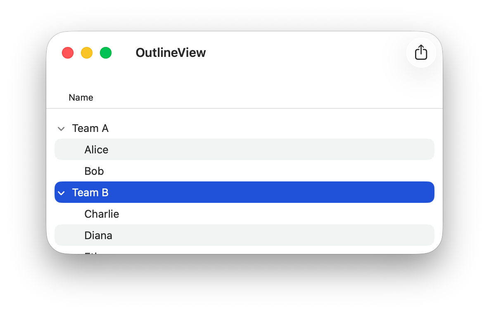

# OutlineView - No Storyboard
An `NSOutlineView` with expandable groups inside an `NSScrollView`, built without Storyboard.

## What's inside
- `MainOutlineViewController` – creates the column and the outline view, acts as data source and delegate
- `DefaultTextCellView` – `NSTableCellView` with an `NSTextField`
- `Model` – `Group` and `Person` conforming to `Attributes`, plus `SampleData`

## Key points
- `outlineTableColumn` – the column that shows the disclosure triangles
- `NSOutlineViewDataSource` – the tree: `outlineView(_:numberOfChildrenOfItem:)`, `outlineView(_:child:ofItem:)`, `outlineView(_:isItemExpandable:)`
- `NSOutlineViewDelegate` – what each cell shows: `outlineView(_:viewFor:item:)`
- Selected row: `outlineViewSelectionDidChange(_:)`

