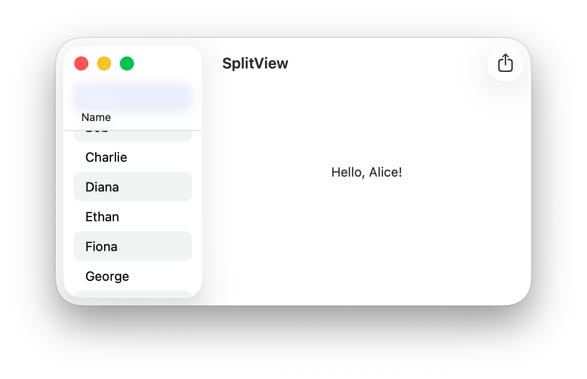
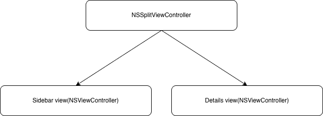

# SplitView - No Storyboard
An `NSSplitViewController` with a sidebar list and a details view, built without Storyboard.



## What's inside
- `MainSplitViewController` – adds the sidebar and the details items
- `SidebarViewController` – `NSTableView` of names
- `DetailsViewController` – shows `Hello, <name>!`
- `AppModel` – shares the selected name between the two views

## Key points
- `NSSplitViewItem(sidebarWithViewController:)` for the sidebar
- `NSSplitViewItem(viewController:)` for the details



`AppModel` passes the selection from the sidebar to the details view:

```swift
class AppModel {
    var selectedName = "" {
        didSet {
            onChange?()
        }
    }

    var onChange: (() -> Void)?
}
```
