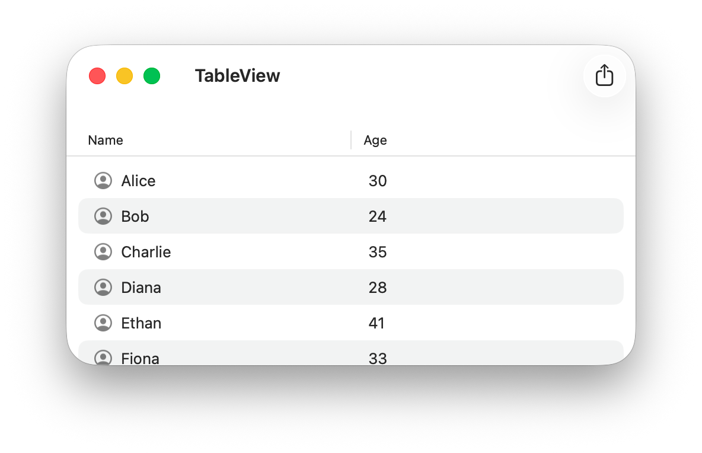

# NSTableView - No Storyboard
## Simple macOS apps using Appkit without Storyboard

An `NSTableView` with two columns. One column uses the `DefaultTableViewCell`.

The other uses a custom `NSTableViewCell` with `NSImageView` and `NSTextfield`.

We need to implement the following two methods:
- How many rows will we need - `NSTableViewDataSource`:

`numberOfRows(in tableView: NSTableView) -> Int`

- and what will be the values of the cells - `NSTableViewDelegate`:

`tableView(_ tableView: NSTableView, viewFor tableColumn: NSTableColumn?, row: Int) -> NSView?`

In case we are curious about the selected row:
`tableViewSelectionDidChange(_ notification: Notification)`

You can read about the topic in [details](https://www.swiftyn.com/learn/macos/mastering-nstableview-data-display-macos).